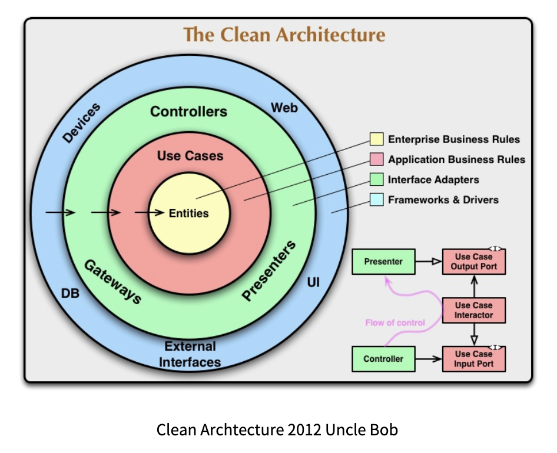

## Architecture

이 앱은 클린 아키텍처를 기반으로 설계됐습니다. 클린 아키텍처는 추후 소프트웨어가 변경하기 유리하도록 설계한 구조입니다. 소프트웨어를 계층으로 나눔으로써 관심사의 분리라는 목표를 달성하고, 특히, 비즈니스 로직과 그외 로직 간의 결합도를 낮추는데 중심을 뒀습니다. 각 계층의 의존성은 단방향으로 흐르는데, 바깥쪽 계층인 저수준 정책부터 안쪽 계층인 고수준 정책으로 의존성이 형성됩니다.

클린 아키텍처를 구현하기 위해 Presentation 레이어, Domain 레이어, Data 레이어로 소프트웨어를 계층화했습니다.

이 중 Presentation 레이어는 다시 MVVM 패턴으로 설계했습니다. MVVM은 뷰와 모델 사이에 뷰모델을 둠으로써 관심사를 분리하고, UI와 모델이 구분되는 패턴인데, 특히 AAC 라이브러리를 통해 더욱 효율적으로 구현할 수 있다는 장점이 있습니다. 뷰가 뷰모델을 observe함으로써 UI에 변경사항이 생기면 자동으로 UI를 갱신하도록 구현했습니다.

## Credit

- Android Jetpack

  - UI
    - Fragment
    - ConstraintLayout
    - ...

  - Architecture
    - Data Binding
    - Lifecycles
    - LiveData
    - Navigation
    - Hilt

- Kotlin

  - Coroutines
  - Coroutines Flow

- Retrofit2

