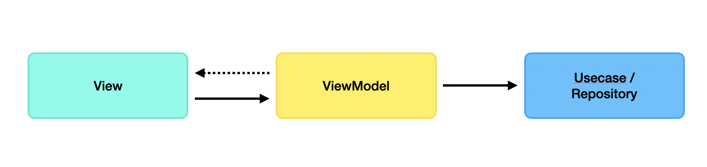

## Architecture

본 프로젝트는 UI 레이어와 Data 레이어로 구성된 MVVM 아키텍처로 설계했습니다. Data 레이어는 Repository를 통해 DataSource를 추상화하고 DataSource로는 로컬 저장소를 사용하는 Persistence와 네트워크 데이터를 사용하는 Remote로 구분됩니다.

데이터를 불러올 때는 Persistence에 데이터가 있는지 확인 후, 데이터가 없다면 Remote로부터 데이터를 불러옵니다.

## Credit

- Android Jetpack

  - UI
    - Fragment
    - ConstraintLayout
    - ...

  - Architecture
    - Data Binding
    - Lifecycles
    - LiveData
    - Navigation
    - Hilt
    - Room

- Kotlin
  - Coroutines
  - Coroutines Flow

- Retrofit2

